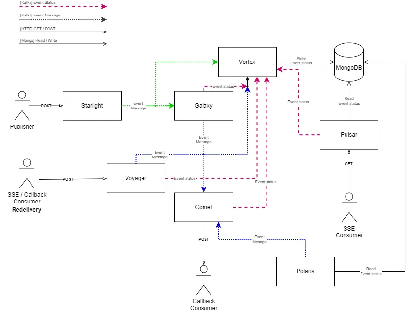

## Horizon

Horizon is an event-driven communication platform designed to facilitate real-time data exchange and interaction between different components within distributed systems. 
It acts as a central hub for managing event publication, delivery and monitoring, providing a reliable and scalable infrastructure for building event-driven architectures.

At its core, Horizon enables seamless communication between various microservices, applications, and systems by decoupling producers and consumers through the use of events. 
It allows producers to publish events without needing to know who will consume them, and consumers to subscribe to specific event types they are interested in without needing to know where those events originated.

Key features of Horizon include:
- **Event Publication**: Producers can publish events to Horizon using predefined event types and payloads. These events are then processed and delivered to subscribers based on their subscriptions.
- **Event Subscription**: Consumers can subscribe to specific event types or topics they are interested in receiving. Subscriptions can include filters to customize which events are delivered based on specific criteria.
- **Event Delivery**: Horizon ensures reliable and timely delivery of events to subscribers, handling retries, acknowledgments, and error handling to guarantee message delivery even in the presence of network failures or system outages.
- **Health Monitoring**: Horizon includes monitoring and alerting functionalities to track the health and performance of the event delivery system, providing insights into system behavior and performance metrics.
- **Scalability and Reliability**: Horizon is designed to scale horizontally to handle large volumes of events and subscribers, ensuring high availability and fault tolerance through distributed architecture and redundancy.

Overall, Horizon simplifies the development of event-driven architectures by providing a unified platform for event management, communication, and monitoring, empowering organizations to build resilient and scalable systems capable of handling real-time data processing and interaction.

## Horizon ecosystem
### Java
- [Horizon Spring Parent](https://github.com/telekom/pubsub-horizon-spring-parent): Contains basic configuration, functionality and models used by all Horizon java components.
- [Galaxy](https://github.com/telekom/pubsub-horizon-galaxy): Responsible for efficient event message multiplexing, managing the flow of events, handling duplicates, and transforming events based on defined response filters.
- [Comet](https://github.com/telekom/pubsub-horizon-comet): Manages the delivery of events to subscribers by handling subscription requests, validating subscriptions, and ensuring timely delivery of events to subscribers.
- [Polaris](https://github.com/telekom/pubsub-horizon-polaris): Monitors the health of subscriber endpoints by periodically sending health check requests, handling endpoint changes, and managing event redelivery based on endpoint status changes.
- [Pulsar](https://github.com/telekom/pubsub-horizon-pulsar): Provides event logging and auditing functionalities, including event storage, retrieval, and analysis, to track event processing and troubleshoot issues.
- [Starlight](https://github.com/telekom/pubsub-horizon-starlight): Offers event monitoring and alerting capabilities by detecting anomalies, monitoring system health, and sending alerts to system administrators or operators when predefined thresholds are exceeded.
- [JSON Filter](https://github.com/telekom/JSON-Filter): Allows to filter JSON objects based on a given filter expression.
### Go
- [Voyager](https://github.com/telekom/pubsub-horizon-voyager): Facilitates event redelivery for failed events by managing event retry policies, maintaining event delivery state, and coordinating event redelivery attempts with subscribers.
- [Vortex](https://github.com/telekom/pubsub-horizon-vortex): Ensure state-fullness by saving all event messages and status updates in the database, excluding the payload.
- [Eventhorizon BFF](https://github.com/telekom/pubsub-horizon-eventhorizon-bff): Provides REST endpoints for the Eventhorizon frontend to access the Horizon ecosystems data like subscription, exposures and event information.
- [Janus](https://github.com/telekom/pubsub-horizon-janus): Provides REST endpoints for the Janus frontend to check customer endpoints for a valid GET/HEAD response.
### Javascript
- [Eventhorizon](https://github.com/telekom/pubsub-horizon-eventhorizon): User interface for the Horizon ecosystem, including event information and Circuit-Breaker information.
- [Janus UI](https://github.com/telekom/pubsub-horizon-janus-ui): User interface to check customer endpoints for a valid GET/HEAD response.

## Architecture
The diagram below shows the general flow and access points of the most important components of Horizon.
# 
Customer endpoints are [Starlight](https://github.com/telekom/pubsub-horizon-galaxy-starlight), 
[Pulsar](https://github.com/telekom/pubsub-horizon-galaxy-pulsar)
and 
[Voyager](https://github.com/telekom/pubsub-horizon-galaxy-voyager). 
Every communication between the components run over Kafka. 
The Vortex component ensures state-fullness by saving all event messages and status updates in the mongodb, excluding the payload.


To publish an event, an eligible publisher has to send a HTTP Post request to Starlights endpoint. Starlight will validate and publish the event message to [Galaxy](https://github.com/telekom/pubsub-horizon-galaxy-galaxy).
Galaxy will multiplex the event message for each subscriber and send it to the [Comet](https://github.com/telekom/pubsub-horizon-galaxy-comet).
Comet will send the event message to the subscriber over HTTP. 

To receive an event, an eligible subscriber has to send a SSE request to Pulsars endpoint. 
Pulsar will validate the request, spot & pick all undelivered event messages from the kafka and return it to the susbscriber.
If one or more new events are available within one minute, Pulsar will forward these event messages to the subscriber until there are no more event messages for one minute.

To query or redeliver an event, an eligible subscriber has to send a HTTP request to Voyagers endpoint. A redelivery spots & picks the event message from the kafka, resets its status and republish them to the Comet.

If you are interested in a more detailed system architecture, click [here](./docs/architecture.md).

## Models
This repository contains models that are crucial for the communication between the Horizon components. 
<br>These models are:
- [Subscription](https://github.com/telekom/pubsub-horizon-spring-parent/horizon-spring/src/main/java/de/telekom/eni/pandora/horizon/kubernetes/resource/Subscription.java): Represents a subscription of a subscriber to a specific event type. This subscription is used to filter and deliver event messages to the subscriber.
- [PublishedEventMessage](https://github.com/telekom/pubsub-horizon-spring-parent/horizon-core/src/main/java/de/telekom/eni/pandora/horizon/model/event/PublishedEventMessage.java): Represents an event message that is published by a publisher.
- [SubscriptionEventMessage](https://github.com/telekom/pubsub-horizon-spring-parent/horizon-core/src/main/java/de/telekom/eni/pandora/horizon/model/event/SubscriptionEventMessage.java): Represents an event message that is multiplexed from a [PublishedEventMessage](https://github.com/telekom/pubsub-horizon-spring-parent/horizon-core/src/main/java/de/telekom/eni/pandora/horizon/model/event/PublishedEventMessage.java) by Galaxy for each subscriber.
- [Status](https://github.com/telekom/pubsub-horizon-spring-parent/horizon-core/src/main/java/de/telekom/eni/pandora/horizon/model/event/Status.java): Represents the status of a [SubscriptionEventMessage](https://github.com/telekom/pubsub-horizon-spring-parent/horizon-core/src/main/java/de/telekom/eni/pandora/horizon/model/event/SubscriptionEventMessage.java).
   <details>
     <summary>Status flow of a SubscriptionEventMessage</summary>

     ```mermaid
       graph TD;
         PROCESSED-->DELIVERING;
         PROCESSED-->FAILED;
         PROCESSED-->DROPPED;
         DELIVERING-->FAILED;
         DELIVERING-->DELIVERED;
         DELIVERING-->WAITING;
         PROCESSED-->WAITING;
     ```
  </details>
- [State](https://github.com/telekom/pubsub-horizon-spring-parent/horizon-core/src/main/java/de/telekom/eni/pandora/horizon/model/db/State.java): Represents the state of a event message in the database. Contains timestamps, kafka location information, filter results, errors, the status and additional metadata like tracing etc.
  <details>
    <summary>Example</summary>
  
    ```json
    {
      "_id": "410eacd1-0fc8-4718-b4cb-c8cf25baeb99",
      "event": {
        "id": "ede6cd87-14d2-4058-8186-f7937bbbdae7",
        "time": "2023-10-24T11:00:36.531Z",
        "type": "some.event.type.v1",
        "_id": "ede6cd87-14d2-4058-8186-f7937bbbdae7"
      },
      "coordinates": {
        "partition": 15,
        "offset": 50678896
      },
      "deliveryType": "CALLBACK",
      "environment": "playground",
      "eventRetentionTime": "DEFAULT",
      "modified": {
        "$date": {
          "$numberLong": "1707984041737"
        }
      },
      "multiplexedFrom": "d32f1150-2978-4641-8ebf-dfcd2b276071",
      "properties": {
        "X-B3-ParentSpanId": "77b58aa703c8e12a",
        "X-B3-Sampled": "1",
        "X-B3-SpanId": "c2a630bd02af829a",
        "X-B3-TraceId": "246db1ad668a55b269929ee9e1d1747f",
        "callback-url": "https://stargate-playground.live.dhei.telekom.de/horizon-aws/callback/v1?url=https://mapigw.dev.oc.telekom.net/api/v1.0/mavi-ingests",
        "selectionFilterResult": "NO_FILTER",
        "subscriber-id": "mpathic--mpathic--mpathic-mavi-dev-3"
      },
      "status": "WAITING",
      "subscriptionId": "5fc7b4b9c10bbe2267d7e5876ca6b9ba0f665687",
      "timestamp": {
        "$date": {
          "$numberLong": "1707984041704"
        }
      },
      "topic": "subscribed"
    }
    ```
  </details>
- [CircuitBreakerMessage](https://github.com/telekom/pubsub-horizon-spring-parent/horizon-core/src/main/java/de/telekom/eni/pandora/horizon/model/meta/CircuitBreakerMessage.java): Represents a circuit breaker message that is opened by the Comet on unsuccessful event message delivery to a subscriber, with a retryable error code. Contains information about the subscriber and subscription, the last health check results, the assigned pod, the status of the circuit breaker message (OPEN, CHECKING, REPUBLISHING). 
  One circuit breaker message is created for each subscription, therefore one circuit breaker message exists for multiple event messages.
  <details>
    <summary>Circuit breaker status flow</summary>
  
    ```mermaid
      graph TD;
        OPEN-->CHECKING;
        CHECKING-->CHECKING;
        CHECKING-->REPUBLISHING;
    ```
  </details>

  <details>
    <summary>Example</summary>  
  
    ```json
    {
        "key": "fa011ae1dfdf1313de81ce9a4689da0dc3f744c9",
        "subscriptionId": "fa011ae1dfdf1313de81ce9a4689da0dc3f744c9",
        "subscriberId": "",
        "status": "CHECKING",
        "environment": "playground",
        "callbackUrl": "https://some-callback-url.com/our-endpoint-1",
        "timestamp": "2023-10-12T06:17:32.533+00:00",
        "lastHealthCheck": {
        "firstCheckedDate": "2024-02-15T07:12:27.823+00:00",
        "lastCheckedDate": "2024-02-15T08:42:29.072+00:00",
        "returnCode": 503,
        "reasonPhrase": "Service Unavailable"
        },
        "assignedPodId": "horizon3-plunger-74f964b969-j4264"
    }
    ```
  </details>


## Code of Conduct

This project has adopted the [Contributor Covenant](https://www.contributor-covenant.org/) in version 2.1 as our code of conduct. Please see the details in our [CODE_OF_CONDUCT.md](CODE_OF_CONDUCT.md). All contributors must abide by the code of conduct.

By participating in this project, you agree to abide by its [Code of Conduct](./CODE_OF_CONDUCT.md) at all times.

## Licensing

This project follows the [REUSE standard for software licensing](https://reuse.software/).
Each file contains copyright and license information, and license texts can be found in the [./LICENSES](./LICENSES) folder. For more information visit https://reuse.software/.