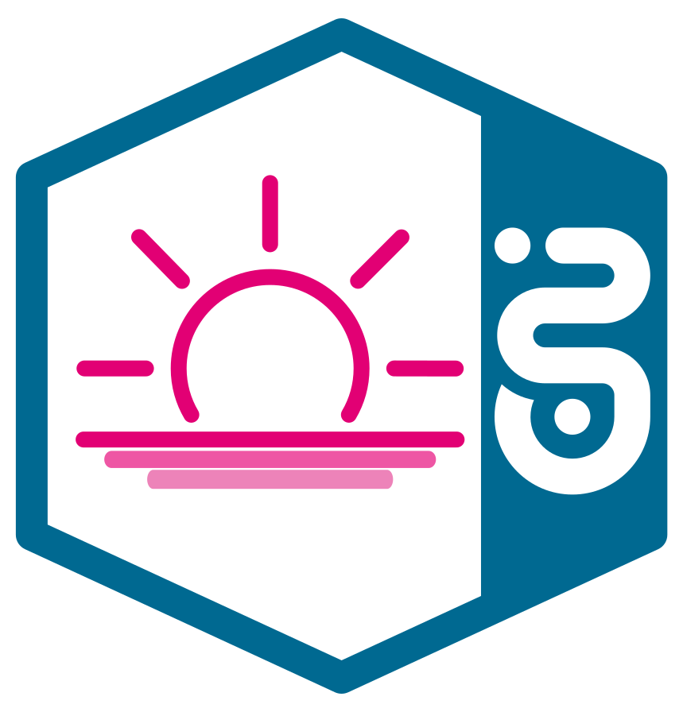
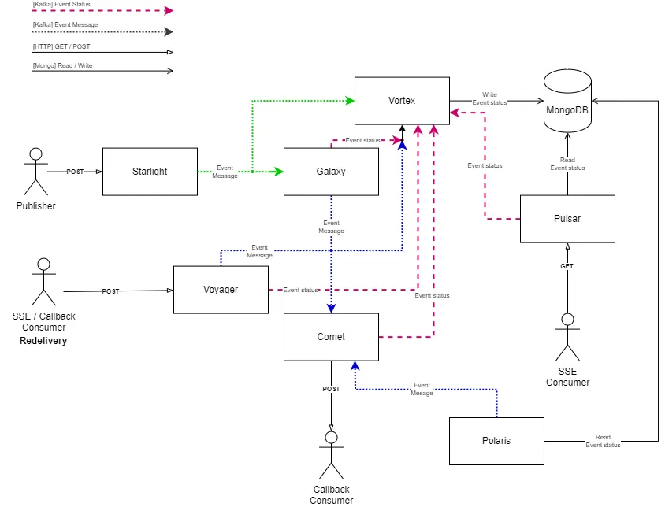

<!--
SPDX-FileCopyrightText: 2024 Deutsche Telekom AG

SPDX-License-Identifier: CC0-1.0    
-->

<p align="center">
  
  <h1 align="center">Horizon</h1>
</p>

<p align="center">
  A cloud intermediary which handles the asynchronous communication between systems through well-defined event messages.
</p>

<p align="center">
  <a href="#features">Features</a> •
  <a href="#horizon-ecosystem"> Horizon ecosystemt</a> •
  <a href="#getting-started">Getting started</a>
</p>

## About

Horizon is an event-driven communication platform implementing the publish–subscribe messaging pattern designed to facilitate real-time data exchange and interaction between different components within distributed systems. 
It acts as a central hub for managing event publication, delivery and monitoring, providing a reliable and scalable infrastructure for building event-driven architectures.  

### Lose coupled design
At its core, Horizon enables seamless communication between various microservices, applications, and systems by decoupling producers and consumers through the use of events. 
It allows producers to publish events without needing to know who will consume them, and consumers to subscribe to specific event types they are interested in without needing to know where those events originated.

### Part of Open Telecom Integration Platform

Horizon has been built as a module of the [Open Telecom Integration Platform](https://github.com/telekom/Open-Telekom-Integration-Platform) and therefore fits seamlessly into the overall solution, utilizing the gateway and IDP provided by the suite. However, if desired, Horizon can be operated independently by using any other gateway and IDP implementing OAuth2.

## Features

Horizon simplifies the development of event-driven architectures by providing a unified platform for event management, communication, and monitoring, empowering organizations to build resilient and scalable systems capable of handling real-time data processing and interaction.  

Key features of Horizon include:  


<details>
<summary><strong>RESTful design</strong></summary>  
Horizon allows event providers to publish events by simply calling an API. There is no need to deal with a specific message broker technology and study all the technical details. Receiving events is similarly simple, either by providing an HTTP endpoint for callback requests or by calling a different API. The existing interfaces make it very easy to integrate Horizon with a wide range of applications as the only capability required is to be able to make an HTTP request or receive one.
</details>
<br />
<details>
<summary><strong>Powerful message filtering</strong></summary>  
Horizon's message filtering capabilities are a hybrid of topic-based and contend-based. Published events are processed and delivered to consumers based on the subscriptions to the corresponding event types. Optionally, consumers can declare simple or more complex filtering rules for customizing what data or parts of the data should be delivered to them based on the contents of the event message.   
In addition, event providers can define scopes for their data for fine-grained control over what subscribers are allowed to see. 
</details>
<br />
<details>
<summary><strong>Guaranteed at least once event delivery</strong></summary>  
Horizon ensures reliable and timely delivery of events to subscribers, handling retries, acknowledgments, and error handling to guarantee message delivery even in the presence of network failures or system outages.  
In addition, consumers have the choice between callback-based delivery and delivery via Server-Sent Events (SSE) server-push technology.
</details>
<br />
<details>
<summary><strong>Scalability and reliability</strong></summary>  
Horizon is designed to scale horizontally to handle large volumes of events and subscribers, ensuring high availability and fault tolerance through distributed architecture and redundancy.
</details>
<br />
<details>
<summary><strong>Monitoring</strong></summary>  
Horizon includes monitoring and alerting functionalities to track the health and performance of the event delivery system, providing insights into system behavior and performance metrics.
</details>

## Horizon ecosystem

### Core components

Horizon's runtime consists of 6 microservices, mainly written in Java (SpringBoot):

- [Horizon Starlight](https://github.com/telekom/pubsub-horizon-starlight) (Java): Offers endpoint for validating and publishing event messages.
- [Horizon Galaxy](https://github.com/telekom/pubsub-horizon-galaxy) (Java): Responsible for efficient event message de-multiplexing, managing the flow of events, handling duplicates, and transforming events based on defined filters.
- [Horizon Comet](https://github.com/telekom/pubsub-horizon-comet) (Java): Handles the timely delivery of events to consumers with provided callback endpoint and takes care of retries in case of consumer unavailability.
- [Horizon Pulsar](https://github.com/telekom/pubsub-horizon-pulsar) (Java): Enables the retrieval of events via Server-Sent Event (SSE) technology by offering a corresponding API endpoint.
- [Horizon Polaris](https://github.com/telekom/pubsub-horizon-polaris) (Java): Ensures fallback safety for various issues that could happen at runtime. Periodically checks the availability of consumer endpoints to redeliver unsuccessful events.
- [Horizon Vortex](https://github.com/telekom/pubsub-horizon-vortex) (Go): Responsible for event sourcing. Derives a status entry from published event messages in addition to other meta information and stores these in the MongoDB database.

### Libraries
- [Horizon Spring Parent](https://github.com/telekom/pubsub-horizon-spring-parent) (Java): Horizon's parent library which contains basic configuration, functionality and models used by all Horizon Java components.
- [JSON Filter](https://github.com/telekom/JSON-Filter) (Java): Generic purpose library which allows to filter JSON objects based on a given filter expression. Is being used for Horizon's message filtering functionality implemented in Horizon-Galaxy.

### Infrastructure

Horizon requires the following infrastructure components in order to operate correctly:

- **Kubernetes**: Horizon makes use of the Kubernetes API by listening for custom resources which are used to store the runtime configuration that includes event subscriptions
- **Kafka**: Horizon uses Kafka as underlying message broker
- **MongoDB**: Is used to store any meta data, in particular for tracking the status information of each individual event message, which provides information whether the event has reached the consumer successfully or not (event sourcing).

### Add-on functionality

- Voyager*: Horizon service which facilitates event redelivery on demand for failed events by managing event retry policies, maintaining event delivery state, and coordinating event redelivery attempts with subscribers.

### Utilities

- Eventhorizon*: User interface for the Horizon ecosystem, including event information and Circuit-Breaker information.
- Janus*: User interface to check customer endpoints for a valid GET/HEAD response.


**Note, that these optional components are not required in order to deploy and operate Horizon and their source code is currently not publicly available. Depending on our capacity we will be probably working on their open source release among other tools/helpers that might be useful when operating Horizon.*

## Architecture
The diagram below shows the general flow and interfaces between the most important components of Horizon.
# 
Customer endpoints are provided by [Starlight](https://github.com/telekom/pubsub-horizon-galaxy-starlight), 
[Pulsar](https://github.com/telekom/pubsub-horizon-galaxy-pulsar)
and 
Voyager. 
Since Horizon itself is an event-driven system, all components communicate with each other by writing and reading messages in and from Kafka. 
The Vortex component ensures that for every message store in the broker a corresponding status entry with meta data information is tracked in MongoDB.

### Workflow

To publish an event, an eligible publisher has to send a HTTP Post request to Starlight's endpoint. Starlight will validate and publish the event message to the underlying message broker whereupon it will be read and processed by [Galaxy](https://github.com/telekom/pubsub-horizon-galaxy-galaxy).
Galaxy will de-multiplex the event message for each subscriber and applies existing filters. [Comet](https://github.com/telekom/pubsub-horizon-galaxy-comet) then takes over and sends the processed event message to the corresponding subscriber over HTTP. 

To fetch an event via the Server-Sent-Events standard (SSE), an eligible subscriber has to send a request to Pulsar's SSE endpoint. 
Pulsar will validate the request, spot & pick all undelivered event messages from Kafka and return it to the subscriber.
If one or more new events are available within one minute, Pulsar will forward these event messages to the subscriber until there are no more event messages for one minute.

In order to query the status for an event or redeliver it, an eligible subscriber has to send a HTTP request to Voyager's endpoint. When requesting the redelivery of an event, Voyager picks the event message from the Kafka, resets its status in Horizon meta data store (MongoDB) and republishes it, so that either Comet or Pulsar will redeliver the event to the consumer depending on the chosen delivery type (callback or SSE).

If you are interested in a more detailed system architecture, click [here](./docs/architecture.md).

## Model
Horizon internally uses a model that is crucial for the communication between the Horizon components. These models are:
- [Subscription](https://github.com/telekom/pubsub-horizon-spring-parent/blob/main/horizon-core/src/main/java/de/telekom/eni/pandora/horizon/kubernetes/resource/Subscription.java): Represents a subscription of a subscriber to a specific event type. This subscription is used to filter and deliver event messages to the subscriber.
- [PublishedEventMessage](https://github.com/telekom/pubsub-horizon-spring-parent/blob/main/horizon-core/src/main/java/de/telekom/eni/pandora/horizon/model/event/PublishedEventMessage.java): Represents an event message that is published by a publisher.
- [SubscriptionEventMessage](https://github.com/telekom/pubsub-horizon-spring-parent/blob/main/horizon-core/src/main/java/de/telekom/eni/pandora/horizon/model/event/SubscriptionEventMessage.java): Represents an event message that is multiplexed from a [PublishedEventMessage](https://github.com/telekom/pubsub-horizon-spring-parent/blob/main/horizon-core/src/main/java/de/telekom/eni/pandora/horizon/model/event/PublishedEventMessage.java) by Galaxy for each subscriber.
- [Status](https://github.com/telekom/pubsub-horizon-spring-parent/blob/main/horizon-core/src/main/java/de/telekom/eni/pandora/horizon/model/event/Status.java): Represents the status of a [SubscriptionEventMessage](https://github.com/telekom/pubsub-horizon-spring-parent/blob/main/horizon-core/src/main/java/de/telekom/eni/pandora/horizon/model/event/SubscriptionEventMessage.java).
   <details>
     <summary>Status flow of a SubscriptionEventMessage</summary>

     ```mermaid
       graph TD;
         PROCESSED-->DELIVERING;
         PROCESSED-->FAILED;
         PROCESSED-->DROPPED;
         DELIVERING-->FAILED;
         DELIVERING-->DELIVERED;
         DELIVERING-->WAITING;
         PROCESSED-->WAITING;
     ```
  </details>
- [State](https://github.com/telekom/pubsub-horizon-spring-parent/blob/main/horizon-core/src/main/java/de/telekom/eni/pandora/horizon/model/db/State.java): Represents the state of an event message in the database. Contains timestamps, Kafka location information, filter results, errors, the status and additional metadata like tracing etc.
  <details>
    <summary>Example</summary>
  
    ```json
    {
      "_id": "410eacd1-0fc8-4718-b4cb-c8cf25baeb99",
      "event": {
        "id": "ede6cd87-14d2-4058-8186-f7937bbbdae7",
        "time": "2023-10-24T11:00:36.531Z",
        "type": "ecommerce.shop.orders.v1",
        "_id": "ede6cd87-14d2-4058-8186-f7937bbbdae7"
      },
      "coordinates": {
        "partition": 15,
        "offset": 50678896
      },
      "deliveryType": "CALLBACK",
      "environment": "playground",
      "eventRetentionTime": "DEFAULT",
      "modified": {
        "$date": {
          "$numberLong": "1707984041737"
        }
      },
      "multiplexedFrom": "d32f1150-2978-4641-8ebf-dfcd2b276071",
      "properties": {
        "X-B3-ParentSpanId": "77b58aa703c8e12a",
        "X-B3-Sampled": "1",
        "X-B3-SpanId": "c2a630bd02af829a",
        "X-B3-TraceId": "246db1ad668a55b269929ee9e1d1747f",
        "callback-url": "https://billing-service.example.com/api/v1/callback",
        "selectionFilterResult": "NO_FILTER",
        "subscriber-id": "ecommerce--billing--order-event-consumer"
      },
      "status": "WAITING",
      "subscriptionId": "4ca708e09edfb9745b1c9ceeb070aacde42cf04f",
      "timestamp": {
        "$date": {
          "$numberLong": "1707984041704"
        }
      },
      "topic": "subscribed"
    }
    ```
  </details>
- [CircuitBreakerMessage](https://github.com/telekom/pubsub-horizon-spring-parent/blob/main/horizon-core/src/main/java/de/telekom/eni/pandora/horizon/model/meta/CircuitBreakerMessage.java): Represents a circuit breaker message that is opened by the Comet on unsuccessful event message delivery to a subscriber, with a retryable error code. Contains information about the subscriber and subscription, the last health check results, the assigned pod, the status of the circuit breaker message (OPEN, CHECKING, REPUBLISHING). 
  One circuit breaker message is created for each subscription, therefore one circuit breaker message exists for multiple event messages.
  <details>
    <summary>Circuit breaker status flow</summary>
  
    ```mermaid
      graph TD;
        OPEN-->CHECKING;
        CHECKING-->CHECKING;
        CHECKING-->REPUBLISHING;
    ```
  </details>

  <details>
    <summary>Example</summary>  
  
    ```json
    {
        "key": "fa011ae1dfdf1313de81ce9a4689da0dc3f744c9",
        "subscriptionId": "4ca708e09edfb9745b1c9ceeb070aacde42cf04f",
        "subscriberId": "ecommerce--billing--order-event-consumer",
        "status": "CHECKING",
        "environment": "playground",
        "callbackUrl": "https://billing-service.example.com/api/v1/callback",
        "timestamp": "2023-10-12T06:17:32.533+00:00",
        "lastHealthCheck": {
        "firstCheckedDate": "2024-02-15T07:12:27.823+00:00",
        "lastCheckedDate": "2024-02-15T08:42:29.072+00:00",
        "returnCode": 503,
        "reasonPhrase": "Service Unavailable"
        },
        "assignedPodId": "horizon-polaris-74f964b969-j4264"
    }
    ```
  </details>

## CRDs

Horizon is a cloud-native solution that requires to be installed in a Kubernetes environment. It depends on the customer resource definition "Subscription" which must be registered in the Kubernetes cluster before installing Horizon components.

### Subscription resource

All subscription information is currently stored in "Subscription" custom resources which will be watched by the Horizon components.
You can find the custom resource definition here: [resources/crds.yaml](./resources/crds.yaml).

A simple example Subscription for callback delivery would look like this:


<details>
  <summary>Example Subscription</summary>

  ```yaml
  apiVersion: subscriber.horizon.telekom.de/v1
  kind: Subscription
  metadata:
    name: 4ca708e09edfb9745b1c9ceeb070aacde42cf04f
    namespace: prod
  spec:
    subscription:
      callback: >-
        https://billing-service.example.com/api/v1/callback
      deliveryType: callback
      payloadType: data
      publisherId: ecommerce--shop--order-events-provider
      subscriberId: ecommerce--billing--order-event-consumer
      subscriptionId: 4ca708e09edfb9745b1c9ceeb070aacde42cf04f
      trigger: {}
      type: ecommerce.shop.orders.v1
  ```
</details><br />

If the creation, update and deletion of subscriptions is to be automated, it is advisable to install a service account with appropriate rights in the cluster namespace in advance. A corresponding example can be found here: [resources/rbac.yaml](./resources/rbac.yaml)


## Getting started

If you want to learn more about how to install and run Horizon in a Kubernetes environment in general, visit: [Installing Horizon](./docs/installation.md)  
But if you want to get started right away with a non-productive local environment and try out Horizon, we recommend visting: [Local installation (Quickstart)](./docs/quickstart.md). 


## Code of Conduct

This project has adopted the [Contributor Covenant](https://www.contributor-covenant.org/) in version 2.1 as our code of conduct. Please see the details in our [CODE_OF_CONDUCT.md](CODE_OF_CONDUCT.md). All contributors must abide by the code of conduct.

By participating in this project, you agree to abide by its [Code of Conduct](./CODE_OF_CONDUCT.md) at all times.

## Licensing

This project follows the [REUSE standard for software licensing](https://reuse.software/).
Each file contains copyright and license information, and license texts can be found in the [./LICENSES](./LICENSES) folder. For more information visit https://reuse.software/.
