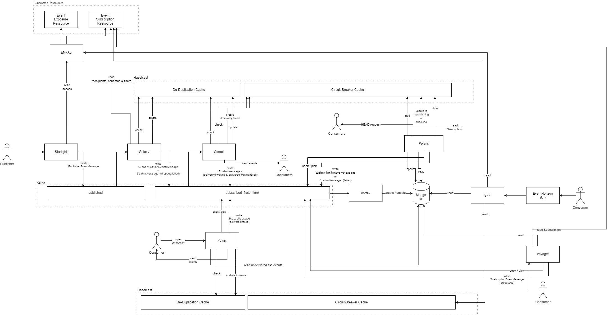

# System architecture
The drawing provides an overview of the overall architecture of Horizon and shows how the individual components interact with each other, which should help to understand the high-level flow of Horizon and components.  

*Please note that the boxes marked with "Hazelcast" do not show different cache instances, but belong together - i.e. they refer to the same cache instance. The separation into several boxes in the graphic is for clarity.*  

*For more detailed flow charts of the individual components/processes, please refer to the documentation of the corresponding sub-component of Horizon.*

## How it works

### Horizon Starlight: Event publishing

Responsibilties:
- Event provider authentication/authorization
- Event message validation
- Schema validation (currently not available in OSS)
- Event publishing (Kafka)

As visible in the graphic above, a publisher (event provider) will start the event flow by sending a POST request to Starlight. The request body of the POST request contains the event data, which consists of metadata and the actual payload (business data). When receiving the request, Starlight will do the authentication, authorization, and validates the event data.  
Authorization is done by comparing the the client ID claim of the oauth2 token with the publisher ID of an event type. The affiliation of Publisher ID and EventType is taken from the custom Kubernetes resource 'Subscription'". 
Starlight caches the Susbcription resources locally and watches for updates via the Kubernetes API.  
Validation takes place in two steps. First, the fields of the request body are checked for their correctness and format. Then the payload is validated against a JSON schema, provided this feature is active and a JSON schema has been configured by the event provider beforehand.  
After all successful checks, Starlight will create a *"published event message"* and write it into the "published" Kafka topic.  

*Please note that the schema validation feature is currently not part of the open source project and will be delivered at a later date.*

### Horizon Galaxy: Message filtering and de-multiplexing

Responsibilties:
- De-duplication
- Message filtering
- De-multiplexing

Horizon's "Galaxy" component listens for messages stored in the "published" topic and consumes all events published through Starlight. Furthermore, Galaxy is responsible for applying message filters that have been configured by the event provider and/or event consumers.  
After filters of the event provider have been applied to the event message, Galaxy applies the filters defined by the consumers. The configured filters are taken from the custom Kubernetes resource "Subscription", that also is getting watched by Galaxy.  
After applying the filters Galaxy creates a *"subscription event message"* for each subscription which also stores a reference to the original *"published event message"*. This reference is used for Galaxy's de-duplication logic to skip the processing of subscription event messages that have been processed before. When no duplication was found, Galaxy will write the event message with the status `PROCESSED` into a new topic that is selected based on the retention time configured by the consumer. Finally, a new entry is added to the de-duplication cache. 

### Horizon Comet: Delivery of event messages via callback

Responsibilties:
- De-duplication
- Event message delivery via callback
- Retry mechanisms
- Enabling circuit-breaker functionality

Comet is one of Horizon's event delivery components which is responsible for delivery to callback URLs provided by consumer services.  
Comet listens on all "subscribed" topics and handles the delivery of all messages with the delivery type "callback". Once it receives a message, Comet will check the de-duplication cache if it already has been delivered. Note, that currently the de-duplication cache is not shared between Galaxy and Comet, but it's shared between the instances of each of those components.  
If a duplicate was found the event gets marked as `DUPLICATE` and will be skipped. Otherwise, if it was not found Comet will check if an active circuit-breaker entry exists for that specific subscription.  
If an active circuit-breaker entry was found, Comet will mark the event as `WAITING` and skip processing. Else it will flag the event as `DELIVERING` and will proceed with the delivery to the consumer's callback endpoint.  
If a consumer answers successfully the event gets marked as `DELIVERED`. If the consumer answers with error-code that is being consired as non-retryable, the event gets marked as `FAILED`.  
If the consumer answers multiple times with a retry-able error code, the event gets set to `WAITING` and the circuit-breaker functionality will be active for the respective subscription.  
The information about whether or not an active circuit-breaker entry exists for a specific callback URL is stored in a distributed cache (Hazelcast).

#### Status tracking

The status update for an event message is done by writing another Kafka message into the same topic as the original message while using the same message key. The new message will only contain the status and some other metadata but not the actual data. Horizon's event sourcing component "Vortex" responsible for deriving the latest status for an event and storing it in a datasbase as a meta data entry which then can be used for tracking and querying each event's status. Each meta data entry also contains the information where to find the actual event message in Kafka (topic, partition, offset).

### Horizon Polaris: Circuit-breaker handling

Responsibilties:
- Circuit-breaker handling
- Detection of processing failures
- Redelivery of events

In a configurable interval (ex. 30 sec) Polaris will check for active circuit-breaker entries and handles the logic for checking the health status of a consumer and the redelivery of events. First, Polaris reads the active circuit-breaker entries from the distributed cache and splits them by hashing the callback-url for the given subscription and applying a modulo with the number of active Polaris pods. Therefore only one Polaris pod will fetch this entry and assigns itself to it. Afterwards, Polaris will spawn a new thread that periodically sends a HEAD or GET request (configurable in the subscription) to the consumer's callback URL to check the consumer's health status. Only if the request is successful, Polaris will retrieve all event meta data entries from the database (MongoDB) with `WAITING` status for all corresponding subscriptions, pick the corresponding event messages from the correct Kafka topics (subscribed, subscribed_5d, ...), reset their status to `PROCESSED` and write them again into the subscribed topic which then will cause a redelivery of the events.

#### Loop detection

If a consumer service somehow builds a loop, by successfully answering the periodic health check, while still being unable to receive any event message (POST request), Polaris will increase the health check interval up to 1 hour. Meaning in a worst-case, events will only get republished every hour.

### Horizon Pulsar: Delivery of event messages via Server-sent events (SSE)

Responsibilties:
- De-duplication
- Event message delivery via SSE

Event delivery via the SSE standard is handled by Horizon Pulsar. If (SSE) consumers wants to retrieve events via SSE, they have to send a HTTP request to Pulsar's SSE endpoint in order to establish a new SSE connection.  
Upon a new request Pulsar will then query the database for any entry with a `PROCESSED` status, marked with the SSE delivery type and matching the consumer's subscription ID which is passed by an URL parameter.  
Each message gets checked by the de-duplication logic like in the other Horizon components. Afterwards, Pulsar will pick the event from the correct Kafka topic (subscribed) and will push it to the consumer service by using the previously established SSE connection. After a successful delivery, the event gets tracked by de-duplication logic and its status will be updated to `DELIVERED`. When all events were sent to the consumer the connection will stay open for 60 more seconds. If no event arrives in that 60 seconds the connection will be closed. Else the incoming events will be forwarded to the consumer. This will repeat until there are no more new events for 60 seconds. 

### EventHorizon: Event status tracking UI

**Not available**  
*Currently not available as open source project. Could also be made available as an open source release at a later date.*

EventHorizon allows event providers and event consumers to track the status of all events in a user interface that provides various filtering capabilties. It also allows to view the (delivered) event messsages itself and provides meta information which can be used for troubleshooting (e.g. event is not received by the consumer).  
It connects with MongoDB used as meta data store and Kafka to retrieve the actual event data.  
The UI also comes with an additional view that provides information about any active circuit-breakers for subscriptions. For this EventHorizon also connects with Polaris to retrieve circuit-breaker information.

### Horizon Voyager: Event redelivery on-demand API

**Not available**  
*Currently not available as open source project. Could also be made available as an open source release at a later date.*

When consumers want to redeliver an event on demand because they may have lost it on their side or it was never delivered since it was marked as `FAILED`, the consumer can trigger the respublishing by using the Horizon Voyager API. Similar to EventHorizon Voyager connects to Horizon's meta data store and Kafka.